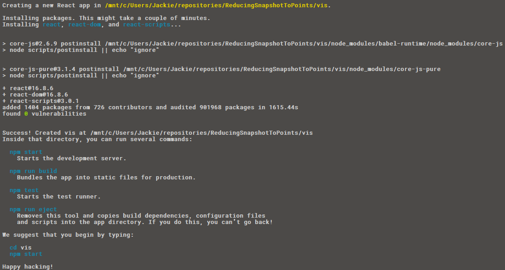
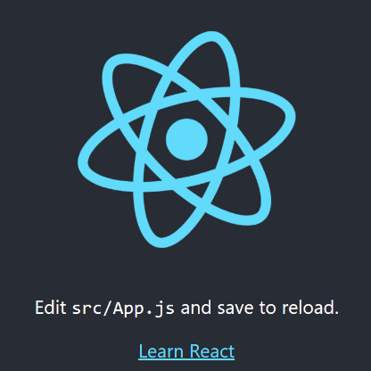

# 浙江大学2019年可视化暑期课程

## 作业要求

> 重要：作业分100分，但只占总成绩的70%，剩下的30%，出勤和态度占10%，现场答辩占20%

1. 实现Reducing Snapshots to Points: A Visual Analytics Approach to Dynamic Network Exploration的可视化界面，实现下图中A B D部分，并完成如下功能（共80分）：

   

   - 将动态图投影到A面板内（20分）
   - 点击A面板内的某个点，可以在B中展示这个点对应的一个图结构（20分）
   - 能够在D中展示上面选中的图结构的度（degree）分布（20分）
     - 度（degree）的概念，如果一个节点连着N条边，那么这个节点的度就是N
   - 完成上述功能得60分，剩下20分
     - 加入颜色编码，得5分（包括A图中，使用时间信息来编码；B图中用班级信息来编码）
     - B视图中，网络中的边的粗细能根据其权重进行变化，得5分（权重越高，说明该时间段内这两个人联系越多，不要求使用曲线边，也不要求区分方向）

   > 助教会提供一个Demo，在vis目录中，你可以进入该目录后，使用`npm i`安装依赖包，然后使用`npm start`就可以启动该Demo。你将会看到左边有一个投影好的结果，右边则是随便选出来的某一个点所对应的图结构。暂时没有任何交互，代码逻辑也很混乱，仅仅提供给你们一个参考，希望各位可以自己去根据作业指南完成作业。在此过程中，助教将不遗余力为你们提供帮助，有任何问题都可以联系助教。

   > 在这个Demo中，还包含了一份假数据，这份假数据的是json格式的。结构大概如下：
   >
   > ```json
   > [{
   >     "vector": [x, y],
   >     "graph": {
   >         "nodes": [{id}],
   >         "links": [{source, target, weight}]
   >     }
   > }]
   > ```
   >
   > 这是一个数组，数组的每个元素是一帧，一帧对应Demo左面的一个节点。这个节点的x，y坐标由vector给出，这个节点对应的图结构由graph给出。其中graph中的nodes和links最重要，分别表示图的节点，和节点之间的关联（source和target表示边连接的两个节点，weight表示边的权重）。


2. 阅读Reducing Snapshots to Points: A Visual Analytics Approach to Dynamic Network Exploration（在本目录下有PDF，北大和浙大的可视化小组都有相关的中文博客解释这篇论文：[北京大学可视化与可视分析博客](http://vis.pku.edu.cn/blog/%E5%B0%86%E6%AF%8F%E4%B8%AA%E6%97%B6%E9%97%B4%E6%AD%A5%E7%9A%84%E5%9B%BE%E9%99%8D%E7%BB%B4%E4%B8%BA%E7%82%B9%E5%8A%A8%E6%80%81%E7%BD%91%E7%BB%9C%E5%8F%AF%E8%A7%86%E5%8C%96%E6%8E%A2%E7%B4%A2/)，[浙江大学可视分析小组博客](http://www.cad.zju.edu.cn/home/vagblog/?p=3832)）

   理解其中的关于如何将【图】转化为【二维坐标】的算法部分，并实现该算法（推荐使用python），并接入到前端系统中（不需要实现3.6中图7 b的Phyllotactic arrangement techniques）(20分)

   > 上面这个算法很简单，从文件读写，数据处理到算法生成和文件存储，大概只有150行不到的代码；推荐有能力的同学自己去尝试写一下这个算法，助教也可以提供相应的答疑；
   >
   > 当然，你也可以放弃这部分的分数，选择我们提供的算法和生成好的数据，可以联系助教获取；

3. 文章的数据集来源：[DATASET: High school dynamic contact networks](http://www.sociopatterns.org/datasets/high-school-dynamic-contact-networks/)，选择2012年的数据；或者直接使用这里提供的[thiers_20912.csv](./thiers_20912.csv)。

4. 【Bonus1】当然可以用其他的数据集来代替该数据，推荐数据集（10分）：

   - <http://konect.uni-koblenz.de/>
   - <http://networkrepository.com/>
   - <https://snap.stanford.edu/data/index.html>

   单纯替换数据并产生结果得5分，如果能从结果中分析出insight（答辩时进行讲解）再得5分。

5. 【Bonus2】实现了其他附加的功能（比如系统其他两个面板，或者其他的交互手段）（10分）

6. 最后一天（20日）上午，我们分组进行答辩


## 作业指南

0. 准备工作

      - 编辑器：[Visual Studio Code](https://code.visualstudio.com/)（推荐，可以选择其他编辑器）
      - 浏览器：Chrome（推荐，可以选择其他浏览器）
      - 版本管理+协同合作工具：[Git](https://git-scm.com/downloads)+[Github](http://github.com)（推荐，但可以不用）
      - [Node.js](https://nodejs.org/zh-cn/)，推荐安装
      - [Python](https://www.python.org/downloads/)，推荐安装，版本3，64位（请安装64位版本的python，不但会有内存问题，因为下载过慢，安装包已经在本项目内提供）

      > Windows用户在安装好Nodejs和python后，不要忘记添加环境变量哦
      >
      > python安装方法：https://www.runoob.com/python/python-install.html
      >
      > nodejs安装方法：<https://www.jianshu.com/p/2d9fa3659645>

      > 如果你没有科学上网，那么建议你在开发前进行换源；
      >
      > pip换源：[Windows](https://blog.csdn.net/Artprog/article/details/75632723)，[MacOS](https://www.jianshu.com/p/f771e1120003)
      >
      > [npm换源](https://www.jianshu.com/p/f311a3a155ff)

1. 后端开发：

   - [Pycharm](https://www.jetbrains.com/pycharm/)：python的IDE，使用ZJU邮箱可以免费注册使用

   - 你可能需要用到的库（安装时如果报错，请尝试用管理员权限：windows用户就是管理员权限打开行命令，macOS就是在命令前加上`sudo`）
     ```
     pip install networkx scipy sklearn
     ```

     - networkx用于处理图数据
     - scipy+networkx用于生成矩阵
     - sklearn的PCA和TSNE等用于进行降维

2. 前端开发：

   - 助教已经给出一个react项目，你只要进入vis文件夹，运行以下命令就可以启动：

     ```
     npm i
     npm start
     ```

     可以直接在给出的项目基础上进行阅读修改。

   - 当然，并没有强制要求写react，毕竟react难度也比较大，同学们可以不用任何框架搭建自己的界面

   - 当然，想要学习如何搭建react的同学，可以进行以下的步骤搭建react项目：

     `npm init react-app vis`

     等待数分钟后（可能会比较久），会在当前目录下创建一个名为`vis`的文件夹。

     

     `cd vis`

     进入文件夹后，会发现会有很多文件生成，其中`src`文件夹内存放了代码。

     

     `npm start`

     启动项目，会在浏览器中自动打开项目，当你看到如下界面时，说明成功：

     

     

   - 安装必要的组件

     ```
     npm install --save-dev d3 antd axios
     ```

     - d3

     - ant design（可选，实用的框架，比如提供了按钮等组件，提供了布局）

       安装完成后，修改 `src/App.css`，在文件顶部引入 `antd/dist/antd.css`。

       ```css
       @import '~antd/dist/antd.css';
       
       .App {
         text-align: center;
       }
       
       ...
       ```

     - axios（可选）

       `npm install --save-dev axios`

       如果有前后端通讯，则可以实用axios用来通讯。


### 关于答辩

1. 现场答辩请展示你们小组的分工，务必每个人都有编程部分（不要某个人只负责答辩）

2. 现场答辩时，需要你实时运行你重构的系统，展现系统所有的功能。

3. 对你们从数据中发现的insight进行解释；比如在哪里发现了什么规律？猜测为什么会出现这个规律？